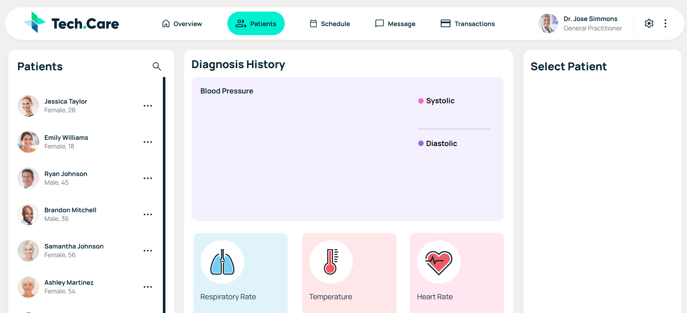
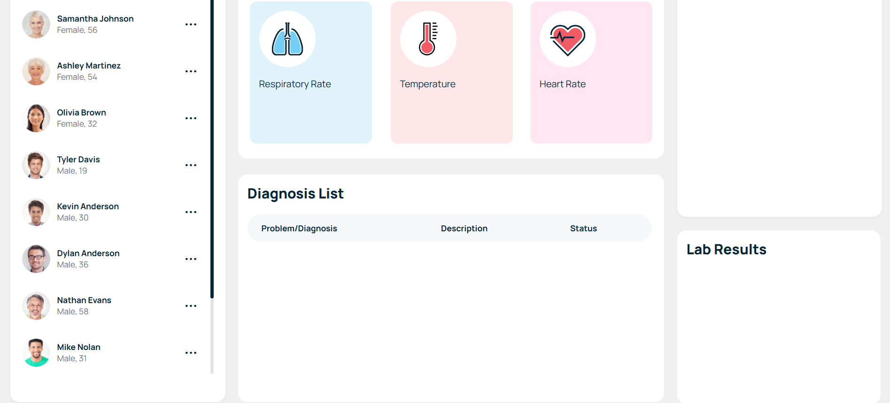
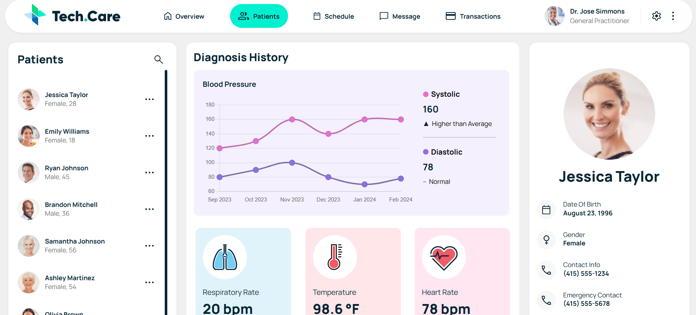
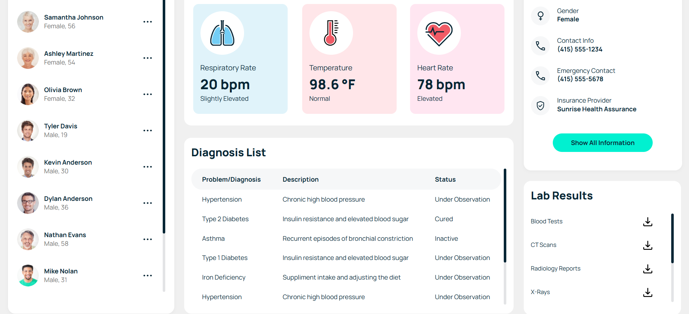

# TechCare Patient Dashboard

## Problem Statement  
Healthcare professionals often struggle with fragmented patient data spread across multiple systems, leading to inefficient diagnosis, poor tracking of vitals, and limited visibility into patient history. The goal was to create a unified, responsive dashboard that consolidates patient information, vital signs, diagnosis history, and lab results into a single, intuitive interface.

## App Demo

 
 

## Strategies Tried  
- Built a static layout using **HTML/CSS** to define the core structure  
- Used **Chrome DevTools** to inspect and manually adjust layout sizing and alignment  
- Applied **Vue.js** to track screen width and conditionally render mobile vs desktop views  
- Implemented **responsive design** using media queries and dynamic class bindings  
- Iteratively refined the layout based on visual feedback and usability testing

## What We Aim to Achieve  
- A fully responsive dashboard that adapts seamlessly across devices  
- Clear visualization of patient vitals and diagnosis trends  
- Easy navigation for doctors to access patient profiles, history, and lab results  
- A clean, modern UI that reduces cognitive load and improves decision-making speed

## Observations from the Project  
- Fixed-width layouts initially caused horizontal scrolling and poor mobile usability  
- Vue’s reactive `screenWidth` tracking enabled dynamic layout switching but required careful CSS coordination  
- Navigation components needed restructuring to behave intuitively on smaller screens  
- Real-time layout testing across breakpoints revealed inconsistencies that were resolved through modular styling
- Chart.js provided a clean and customizable way to visualize blood pressure trends, respiratory rates, and other vitals
- Responsive behavior required manual tuning to ensure charts resized correctly across breakpoints
- Tooltips and legends were styled to match the dashboard’s design system
- Data updates were reactive, allowing charts to reflect real-time changes in patient metrics

## Recommendations & Improvements  
- Refactor layout containers to use **flexbox/grid** with percentage-based widths for better fluidity  
- Modularize components using Vue’s **component system** for maintainability  
- Introduce **Vue Router** for actual navigation logic tied to dropdown selections  
- Add **unit tests** for layout behavior across screen sizes  
- Consider integrating **Tailwind CSS** or **SCSS** for scalable styling  
- Optimize asset loading and responsiveness for performance on low-bandwidth devices

## Technologies Used  
- **HTML5** & **CSS3**  
- **JavaScript (ES6)**  
- **Vue.js** (Composition API)
- **Chart.js** for interactive data visualizations 
- **Chrome DevTools** for layout debugging  
- **Responsive Design** via media queries  
- **Custom CSS Variables** for design consistency
